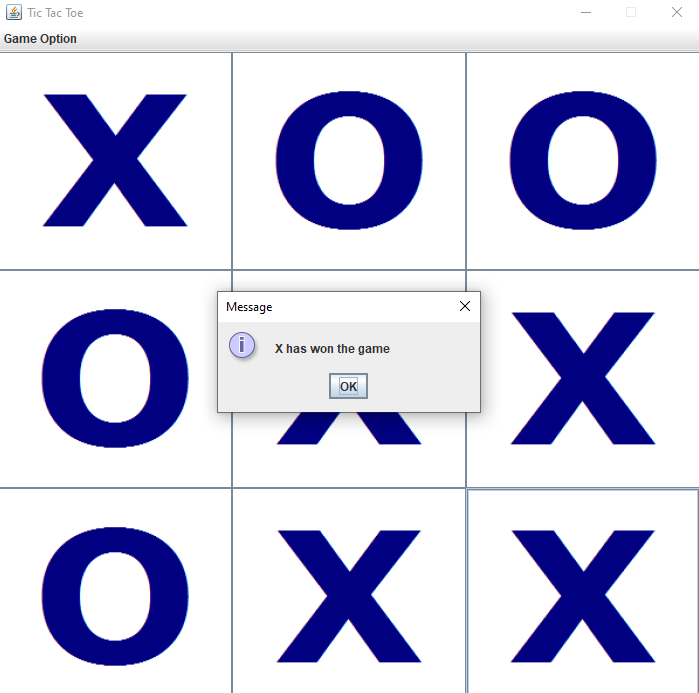
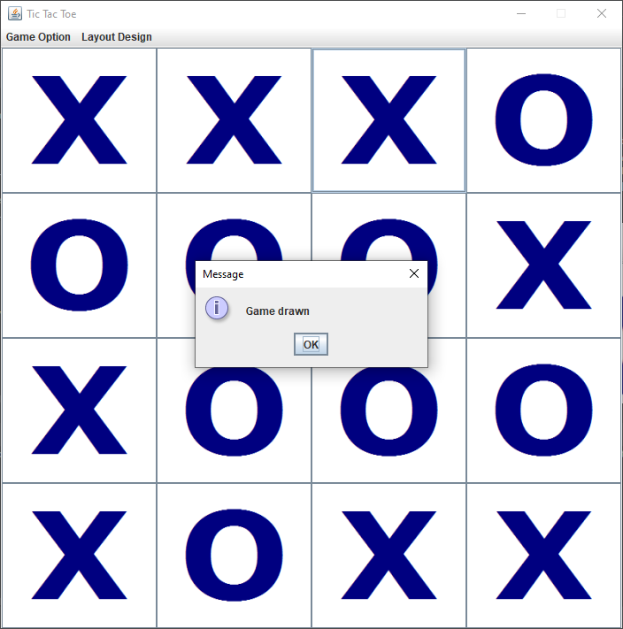

## Getting Started

Welcome to the VS Code Java world. Here is a guideline to help you get started to write Java code in Visual Studio Code.

## Folder Structure

The workspace contains two folders by default, where:

- `src`: the folder to maintain sources
- `lib`: the folder to maintain dependencies

## Dependency Management

The `JAVA DEPENDENCIES` view allows you to manage your dependencies. More details can be found [here](https://github.com/microsoft/vscode-java-pack/blob/master/release-notes/v0.9.0.md#work-with-jar-files-directly).

## To start the game

This game allows user to choose between playing against AI or another friend
No. | Steps
--- | ---
1.| Double click TicTacToe.jar file
2.| There is an option in the menu that allow user to choose whether to play againt AI or friend
3.| After that, user must choose the grid layout before they can start the game, which range from 3x3 and above
4.| The game will restart if there's a winner or it is a draw

## The AI gets weaker as grid increase
No. | AI
--- | ---
1.| The AI will only prevent user from winning from 4x4 and above grid
2.| However the AI will want to win if its 3x3 grid layout

